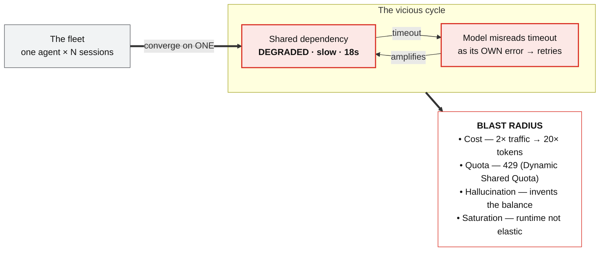
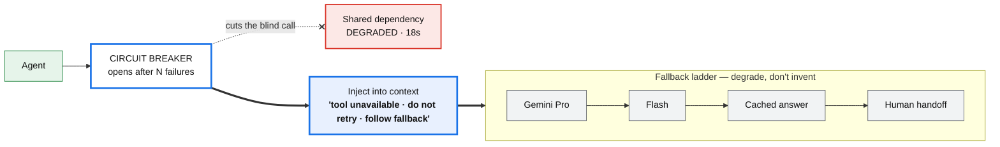

# Caso 2 — Resiliência & Custo sob carga · Fundamentos e Slides

> Doc de referência denso do Caso 2 (PT; diagramas e speaker notes em EN, porque os slides são em inglês).
> Espelha `eval-agentes-fundamentos.md` (Caso 1). Resumo estratégico em `../en/cases/case-2.md` e `../en/blueprint-presentation.md`.
> Agente-base: atendimento financeiro (lê PII + emite reembolso), o **mesmo** agente que amadurece pelos 3 casos.

---

## Índice
1. [A tese L400 — é relevante? (discussão honesta)](#1-a-tese-l400)
2. [A ponte de entrada (Caso 1 → Caso 2)](#2-a-ponte-de-entrada)
3. [A câmera / arco emocional](#3-a-câmera)
4. [O arco em 5 atos](#4-o-arco-em-5-atos)
5. [Slide 5 — "The Cascade" (problema)](#5-slide-5--the-cascade)
6. [Slide 6 — "Contain the blast" (clímax)](#6-slide-6--contain-the-blast)
7. [Slide 7 — governar custo (pendente)](#7-slide-7--governar-custo-pendente)
8. [Landmines e decisões travadas](#8-landmines-e-decisões-travadas)

---

## 1. A tese L400

**Veredito honesto (não auto-convencimento).**

- **Relevância pra produção: altíssima.** Custo explodindo e retries em cascata são das primeiras dores que todo time bate ao pôr agente em produção — antes de eval, antes de zero-trust. Nesse eixo, o Caso 2 é provavelmente o **mais imediatamente útil** dos três.
- **Novidade L400: condicional, e é o eixo em risco.** Resiliência é campo maduro. Circuit breaker, fallback, backoff-com-jitter, comprar capacidade reservada — um SWE sênior (Accenture) já conhece há 15 anos. Se qualquer beat soar como o mecanismo genérico, rebaixa pra L200. **A linha é fina.** O que salva é *exclusivamente* o twist de agente.

**O que carrega o peso L400 (o que um sênior NÃO traz de microsserviços):**
1. **O modelo relê o erro e retenta na camada de raciocínio** — invisível pro backoff de infra. Retry duplo.
2. **O breaker semântico (injetar no contexto).** Devolver erro pra um loop de raciocínio não funciona — ele reinterpreta. Falar a língua do modelo é a joia.
3. **Alucinação como falha de disponibilidade.** Componente que, ao quebrar, mente com confiança em vez de dar 500. Reenquadrar "hallucination" como *availability* é virada que só existe com agentes.
4. **Economia: custo não-linear + não-capturado.** 2×→20×, e a plataforma não dá custo por span → você instrumenta.

**Onde o caso é FRACO pra L400 (vigiar):**
- **Provisioned Throughput vs DSQ é o elo mais fraco** — é "compre capacidade reservada", conhecimento de produto/procurement, não disciplina. **NÃO fazer disso depth spike.** Reframe: a disciplina é *decidir o comportamento no limite* (spillover vs 429) + combinar com budget por sessão + backoff. O engenheiro leva a **política**, não o SKU.
- **Fallback ladder por si só é óbvio.** A novidade é *degrade, don't invent* + "cada degrau é sua decisão de error budget".
- **O breaker como mecanismo é commodity** → a **injeção no contexto** é o herói. Regra de ferro: **todo beat abre pelo twist, não pelo mecanismo.**

**Litmus test:** *"Um SWE sênior que já construiu microsserviços aprende algo novo?"* Só com breaker/fallback/PT → não (L200). Com os 4 twists acima em primeiro plano → sim (L400). O caso **passa** se os twists estão na frente e os mecanismos ficam de pano de fundo.

**A espinha que blinda o caso (uma frase):**
> Resiliência clássica pressupõe componentes determinísticos que falham alto. Um agente é um componente **estocástico** que falha em silêncio e **amplifica** — reinterpreta erros, retenta invisível, e alucina em vez de errar. Então o playbook inteiro tem que ser **re-derivado para um componente que raciocina.**

Corolário de forma: **cada padrão clássico quebra de um jeito novo com agentes** (tabela abaixo). É o fio que atravessa cada beat.

| Padrão clássico | Por que quebra com agentes |
|---|---|
| Circuit breaker devolve erro | O LLM relê o erro como "errei o parâmetro" e tenta de novo → injetar no **contexto**, não no retorno |
| Retry com backoff na infra | O **modelo também retenta**, na camada de raciocínio, invisível → retry duplo |
| Autoscaling horizontal | Custo de token é **não-linear** → escalar amplifica a conta, e ainda bate no mesmo 429 |
| Fallback devolve erro/cache | O agente pode **alucinar** em vez de falhar honesto → indisponibilidade silenciosa |

---

## 2. A ponte de entrada

Gancho já plantado no Slide 1 do Caso 1: `issue_refund → Payment system`. Frase de transição (honesta com o Caso 1):

> *"O eval provou que a agente está correta. Mas o eval rodou num ambiente simulado, uma sessão por vez. Ele não disse nada sobre o que acontece quando mil dessas agentes batem na mesma API lenta ao mesmo tempo."*

Respeita o Caso 1 (eval é necessário) e motiva o Caso 2 (eval não é suficiente pro comportamento **sistêmico**). Correção ≠ resiliência.

---

## 3. A câmera

Caso 1 = macro→micro→mezzo→macro. Caso 2 tem câmera própria:

**afasta (a frota) → contágio (o vermelho se espalha) → aproxima (um waterfall) → clique (o breaker corta) → afasta (governança/custo na árvore).**

Largo → pânico → diagnóstico → controle → economia sob controle. O ritmo espelha a emoção.

---

## 4. O arco em 5 atos

- **Ato 1 — O sucesso vira o inimigo.** *(câmera afasta)* A câmera puxa pra trás do diagrama-âncora do Caso 1 e revela: aquilo era uma célula. Agora são muitas — a **frota** — dividindo **uma** dependência. Quebra *porque* deu certo (foi adotada).
- **Ato 2 — A cascata (a ferida).** *(contágio)* A dependência degrada (lenta, não caída). O modelo lê timeout como erro próprio → retenta. ×N = **retry storm** → amplifica. Sintomas: 20× tokens, 429/DSQ, saldo inventado, runtime satura. **Herói conceitual:** sistema distribuído estocástico. Não é `max_iterations`.
- **Ato 3 — O diagnóstico.** *(aproxima em UM waterfall)* O waterfall acha o culpado ("modelo 1s, tool 18s"). Observabilidade **motivada**, setup do breaker.
- **Ato 4 — Conter (clímax + herói).** *(clique)* Breaker semântico injeta a degradação **de volta no contexto**. Fallback ladder → *degrade, don't invent*.
- **Ato 5 — Não só sobreviver, governar.** *(afasta pra árvore de custo)* Cost/span (sua instrumentação) → budget por sessão (local) → PT vs DSQ + FinOps na árvore (global). Visibilidade vira gestão.

**Ponte de saída (→ Caso 3):** *"Agora é resiliente. Mas resiliente ≠ segura — e tudo mexe com dinheiro e PII."*

**Forma:** 3 slides (não 2). Cada movimento respira; o custo ganha o espaço que merece.

---

## 5. Slide 5 — "The Cascade"

**Papel:** a ferida. **Câmera:** afasta (frota) → contágio. **Cor:** vermelho. **Sem demo** (conceito puro). **Título:** "The Cascade" (subtítulo opcional: *"one slow dependency, amplified by the fleet"*).

### Arquitetura — motor de loop vicioso com entrada e explosão

Estrutura causal = **entrada → ciclo vicioso → estilhaço.** (Aprendizado de forma: layout radial/hub embola; o certo é fluxo com o **loop girando** no centro.)



**Notas de build (Slides / Nano Banana):**
- **A frota = UM objeto:** carta da frente = a espinha do Caso 1 (`main → refund specialist → look up → issue refund`); atrás, **cartas desbotadas empilhadas** + badge `× N`. Resolve o "azul flutuante" e entrega "uma célula de uma colônia".
- **A dependência = forma de serviço** (retângulo/hexágono), **nunca cilindro/DB**.
- **O ciclo vicioso é o protagonista visual:** duas setas como um **círculo grande girando** (uma "timeout →", a de volta "amplifies →"); anime a rotação no reveal 5. Deixar **as duas sólidas e vermelhas** (não misturar tracejado/sólido — não significa nada).
- **O blast = leque à direita**, vermelho, lido como consequências (saem do loop), não pares.
- **Cor = significado:** vermelho = falha; neutro = saudável. Sem amarelo/azul decorativo.
- Mermaid é só a fonte da verdade de conteúdo/topologia; o visual final é desenhado (Slides) ou gerado (Nano Banana) com texto real por cima.

**Reveals (7):**
1. A frota (baralho + `× N`). *"Mesma agente, muitas sessões."*
2. Convergência numa dependência (funil).
3. Degrada (vermelha, 18s).
4. A sabotagem — modelo lê timeout como erro próprio → retenta.
5. O loop fecha — "amplifies" volta; o círculo gira. Pânico (nomeia retry storm).
6. A explosão — 4 sintomas.
7. Herói conceitual + punchline.

`18s` é número de **cena** (ilustra a dependência lenta), não de impacto — pode ficar.

### Speaker notes (EN)
> *(open — pay off the Case 1 bridge)*
> "In Case 1 we earned the green score. But that eval ran in a simulated environment — one session at a time. It never saw a fleet.
> *(reveal 1)* In production it's never one agent. It's the same agent, running as a fleet — many concurrent sessions.
> *(reveal 2)* And they all share the same dependencies. They converge on one downstream service.
> *(reveal 3)* Now that dependency degrades. Slow, not down — eighteen seconds per call.
> *(reveal 4)* Here's the part that's specific to agents. A normal system sees a network timeout. The model does not. It reads the timeout as *its own mistake* — 'I must have passed the wrong parameter' — so it tries again.
> *(reveal 5)* Multiply that by N sessions, all retrying at once. That's a retry storm. And the storm amplifies the very outage it's reacting to. The cycle feeds itself.
> *(reveal 6)* Four things happen together. Cost: a two-times traffic spike becomes twenty-times the tokens. Quota: the model endpoint hits its shared limit and returns 429s. Hallucination: when the tool stalls, the agent doesn't say 'I don't know' — it invents the balance. And the runtime itself saturates — it is not infinitely elastic.
> *(reveal 7)* So the real problem is not one agent stuck in a loop. It's a stochastic distributed system — a fleet amplifying one dependency's outage, with non-linear cost. One dependency went down, and it took your agent — and your bill — with it.
> *(trivial-twin inoculation — say it, don't slide it)* And to be clear: this is not something you fix with a `max_iterations` cap. That limits one agent. It does nothing for a fleet amplifying a shared dependency.
> *(hand off to Slide 6)* So the first question is: which dependency? Let's open the trace."

Timing ~75–90s. Inegociável: reveal 7. `max_iterations` pode virar resposta de Q&A se apertar.

### Defesas de Q&A (Slide 5)
- **"Não é só thundering herd clássico?"** → Na infra, sim. O amplificador novo é o **modelo**: repete na camada de raciocínio (invisível pro backoff) e **alucina** em vez de falhar.
- **"Por que não escalar horizontal?"** → Custo de token é **não-linear**; escalar multiplica a conta e ainda bate no **mesmo 429 do DSQ**.
- **"`max_iterations` não resolve?"** → Limita **uma** agente. Nada faz por uma **frota** amplificando dependência compartilhada. Altitude errada.

---

## 6. Slide 6 — "Contain the blast"

**Papel:** o vira-jogo. **Câmera:** aproxima em UM waterfall → clique (breaker corta). **Cor:** vermelho vira verde. **Demo tecida** (3 beats). **Título:** "Contain the blast" (ou "Cut the loop").

### Arquitetura — duas movimentações: (A) diagnóstico + (B) contenção

**Parte A — o waterfall (diagnóstico · demo beat 1).** Barra de tempo (Gantt), não flowchart:
```
DIAGNOSIS — one trace, where did the 18s go?
  Model      ▐█▌ 1s                                  (green)
  Look-up    ▐███████████████████████▌ 18s   ← culprit (red)
  ───────────────────────────────────────────► time
  "The model is fine. The dependency degraded."
```
Observabilidade **motivada** — 1 beat rápido, emenda no breaker. Não é tour de tracing.

**Parte B — contenção (breaker semântico + fallback ladder):**


**O herói do slide é a seta grossa `CB ==> INJECT`.** Um breaker normal só faz a parte fina tracejada (`cuts the call ✕`) — e o modelo relê o erro e tenta de novo. O **semântico** injeta o fato **de volta no contexto**. Erro de infra vira **fato determinístico**. Essa é a diferença L400.

**Notas de build:**
- **A seta de injeção é a maior/mais forte** (azul, grossa). A seta pro dependency é **fina, tracejada, ✕** (o familiar). Contraste visual = a mensagem.
- **O waterfall = duas barras horizontais** (escala de tempo real): modelo curto/verde, tool longa/vermelha, callout "18s". Fica em cima/à esquerda como lead-in.
- **A fallback ladder desce/degrada** — Pro → Flash → cache → humano; cada degrau mais apagado. Rótulo: *degrade, don't invent* (NÃO "never hallucinate" — ver §8).
- **Cor = significado:** vermelho = degradado/corte cego; azul = a intervenção; verde = desfecho gracioso.
- **Continuidade:** a "Shared dependency · 18s" é a **mesma** do Slide 5; o breaker aparece *em cima* dela.

**Reveals (6 + 3 demo beats tecidos):**
1. Diagnóstico — o waterfall (modelo 1s vs tool 18s). **[DEMO beat 1: abre a trace real no console]**
2. Embrulha o culpado — breaker na frente da dependência que a trace apontou.
3. Abre e corta — após N falhas o breaker abre; a seta cega vira ✕. **[DEMO beat 2: gráfico de tokens/latência subindo → o breaker corta]** — deixa respirar.
4. **O HERÓI — injeta no contexto** — *"tool unavailable · do not retry · follow fallback."* Fala o contraste com o breaker normal.
5. Fallback ladder — Pro → Flash → cache → humano. *Degrade, don't invent.* Cada degrau é *sua* decisão.
6. Desfecho + ponte — **[DEMO beat 3: fallback responde em ~2s, degradação graciosa em vez de saldo inventado]**. Fecha: *"contivemos o incidente. Mas ainda não governamos o custo."* → Slide 7.

### Speaker notes (EN)
> *(pick up from Slide 5's last line: "which dependency?")*
> "So — which dependency? We don't guess. We open the trace.
> *(reveal 1 · demo beat 1)* Here is one request, broken down by step. The model responded in one second. This look-up tool took eighteen. The fault is not the model — it's the external dependency. Observability didn't just tell me it was slow; it told me *where*.
> *(reveal 2)* Now I contain it. And I wrap exactly the dependency the trace pointed at — not blindly, everywhere. I put a circuit breaker in front of it.
> *(reveal 3 · demo beat 2)* After N failures, the breaker opens and stops calling the dead dependency. Watch the dashboard — the tokens and latency are climbing… and the breaker cuts it off. *(let it breathe)*
> *(reveal 4 — the hero)* But here is the part that matters for agents. A normal circuit breaker just returns an error. The model would read that error, reinterpret it, and try again. So I don't return an error — I **inject the fact back into the context**, in language the model understands: 'this tool is unavailable; do not retry; follow the fallback.' That turns an infrastructure error into a deterministic instruction.
> *(reveal 5)* And then the fallback ladder. What do you do when the tool is down? Degrade — don't invent. Try a cheaper model, then a cached answer, then hand off to a human. Each rung is your decision — the platform does not decide this for you.
> *(reveal 6 · demo beat 3)* The result: the agent responds in about two seconds with honest, degraded service — instead of inventing a balance. We turned a silent, expensive outage into a controlled, cheap failure.
> *(bridge to Slide 7)* We contained the incident. But surviving is not the same as governing. We still haven't answered: what did this cost — and who pays for it?"

Timing ~2 min (com os 3 beats). Inegociável: **reveal 4** (injeção no contexto) — o único conceito que separa isto de "circuit breaker de microsserviço".

### Defesas de Q&A (Slide 6)
- **"Circuit breaker não é padrão antigo?"** → O padrão sim; o **twist** é injetar no contexto porque o consumidor é um raciocinador que reinterpreta erro. Devolver 500 pra um loop de raciocínio não contém — realimenta.
- **"E se o próprio fallback (Flash) alucinar?"** → Por isso a escada **termina** em degraus determinísticos (cache/humano). O objetivo é *degrade, don't invent*, não "modelo nunca erra".

---

## 7. Slide 7 — governar custo (pendente)

**Papel:** de sobreviver → governar. **Câmera:** afasta pra árvore de custo. **Cor:** verde/controle. **Ainda NÃO desenvolvido.**

Conteúdo previsto (Ato 5): cost/token **por span** (sua instrumentação — a plataforma não captura custo, token vem agregado) → **budget por sessão** (contém o blast **localmente**) → **PT vs DSQ** (a alavanca do 429, mas **não** como estrela) + caching + routing (seu código) → **FinOps na árvore** (Billing→BigQuery + labels → custo por user/project/org; visibilidade vira **gestão**). Ponte de saída pro Caso 3.

**Lente travada (§1):** o protagonista é a **economia** (custo não-linear, cost/span, FinOps na árvore) — muito mais L400 e raro de ver bem-feito do que "compre capacidade reservada". PT fica coadjuvante.

---

## 8. Landmines e decisões travadas
- **"never hallucinate" → RECUSADO.** Absoluto atacável e nem mecanicamente verdadeiro (Flash na escada pode alucinar). Frase oficial: **"Degrade, don't invent"** (a escada termina em degrau determinístico: cache/humano). O objetivo é trocar "inventa o saldo" por degradação honesta, não zerar alucinação.
- **Provisioned Throughput NÃO é depth spike** — é procurement. A disciplina é a **política** (spillover vs 429 + budget + backoff), não o SKU.
- **Todo beat abre pelo twist, não pelo mecanismo** (senão vira L200).
- **Waterfall não é tour de tracing** — entra como diagnóstico motivado, 1 beat, emenda no breaker.
- **Custo NÃO é capturado pela plataforma; token vem agregado** → cost/span é instrumentação sua. Dizer no palco.
- **Não há router gerenciado**; Pub/Sub/Cloud Tasks é sua arquitetura. Dizer.
- **Impacto em ordem de grandeza**, nunca falso-preciso ("dezenas de seg → poucos seg"; "spike de tokens, não explosão 20× como número de impacto"). `18s`/`2×→20×` são números de **cena**, ficam.
- **Só o 403 do Caso 3 é genuinamente real**; demos do Caso 2 demonstram *partes* (mock honesto; tool lenta = `time.sleep(15)`). O Caso 2 é o único candidato a "live" controlado, com vídeo de fallback aberto.
- **Forma de diagrama:** loop vicioso NÃO em layout radial/hub (embola). Fluxo com o loop girando no centro. Cor só carrega significado.
